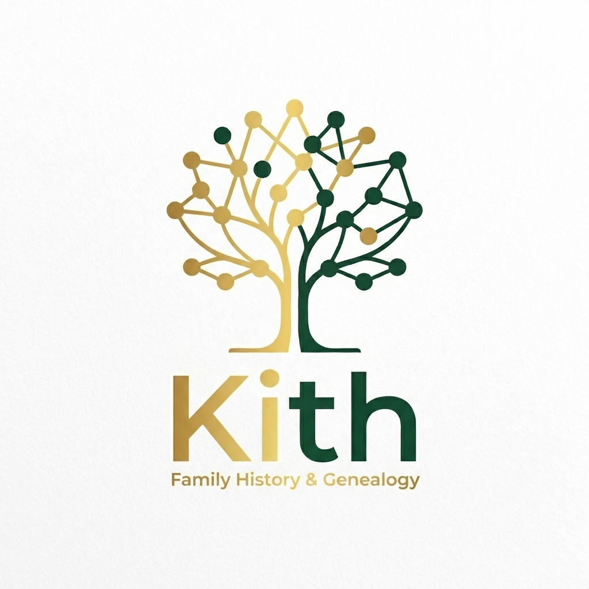

<p align="center">
  
</p>

# Kith

Kith is a modern family history and genealogy application built to help you visualize, explore, and preserve your family's legacy.

## Features

- **Interactive Family Trees:**
  - **Vertical & Horizontal Trees:** Hierarchical visualizations of family lineages.
  - **Pedigree & Fan Charts:** Specialized ancestry visualizations for research and exploration.
  - **DNA & World Maps:** Geospatial and genetic data visualizations.

- **Member Management:**
  - **Onboarding:** Smooth welcome experience for first-time users.
  - **Family Directory:** Searchable and filterable list of all members.
  - **Family Management:** Tools to add members and define complex relationships.
  - **Detailed Biographies:** Rich profiles for every family member.

- **Engagement & Personalization:**
  - **Activity Feed (Memories):** A social timeline of family events and stories.
  - **Media Gallery:** Unified view of family photos and documents.
  - **Advanced Settings:** Granular control over Account, Preferences (including reactive Dark Mode), and Privacy.
  - **Discover:** Intelligent tools for finding connections.

- **Robust Backend:**
  - **RESTful API:** Node.js/Express service for data persistence.
  - **Database Migrations:** SQL-based schema management with PostgreSQL.

## Tech Stack

- **Frontend:** React 19, Vite, TypeScript, Tailwind CSS
- **Backend:** Node.js, Express.js, TypeScript, PostgreSQL (via `pg`)
- **Infrastructure:** Docker, Docker Compose
- **Testing:** Vitest, React Testing Library, Supertest
- **Icons:** Material Symbols

## Getting Started

### Prerequisites

- Node.js (v18+)
- Docker & Docker Compose (for database and full-stack environment)

### Installation

1.  **Clone the repository:**

    ```bash
    git clone <repository-url>
    cd Kith
    ```

2.  **Install dependencies:**

    ```bash
    npm install
    ```

3.  **Environment Setup:**
    Create a `.env.local` file for the frontend and a `server/.env` for the backend based on the provided examples.

### Running the Application

- **Full Stack (with Docker):**

  ```bash
  docker-compose up
  ```

- **Frontend Development:**

  ```bash
  npm run dev
  ```

- **Backend Development:**

  ```bash
  cd server && npm run dev
  ```

- **Run Tests:**
  ```bash
  npm run test        # Frontend tests
  cd server && npm run test # Backend tests
  ```

## Project Structure

```
Kith/
├── components/          # React Components (Views, Widgets, Modals)
│   ├── FamilyTreeView.tsx
│   ├── FamilyManagement.tsx
│   ├── SettingsView.tsx
│   ├── DNAMap.tsx
│   ├── MediaGallery.tsx
│   └── ...
├── server/              # Node.js/Express Backend
│   ├── controllers/     # Request Handlers
│   ├── routes/          # API Route Definitions
│   ├── middleware/      # Custom Express Middleware
│   ├── migrations/      # SQL Schema Migrations
│   └── db.ts            # Database Connection
├── services/            # Frontend API Clients
│   ├── FamilyService.ts
│   ├── TreeService.ts
│   ├── ActivityService.ts
│   ├── LocationService.ts
│   ├── DiscoverService.ts
│   └── ...
├── context/             # React Context Providers
├── types/               # Shared TypeScript Definitions
├── src/utils/           # Shared Utility Functions
├── scripts/             # Utility Scripts (Verification, Secrets Check)
├── mocks/               # Static Mock Data for Dev/Testing
├── tests/               # Backend & Integration Tests
├── conductor/           # Project Tracks & Planning
└── docker-compose.yml   # Infrastructure Orchestration
```

## Specialized Skills

Kith leverages specialized Gemini skills for automated maintenance:

- **Tree Architect:** Genealogy data & visualization logic.
- **Test Factory:** Mock data & unit test generation.
- **Doc Maintainer:** Documentation synchronization.
- **Schema Maintainer:** Database schema consolidation.
- **API Bridge:** Full-stack data model synchronization.
- **Conductor:** Development track orchestration.

## Navigation

The application uses a custom state-based navigation system located in `App.tsx`. A global "View Switcher" is available in the top-right corner for quick access to all screens during development.
